<p align="center">
  <a href="./Screenshots">
    
  </a>
</p>

# ⏱️ Full Screen Timer  
### Focus better with a clean, distraction-free timer  

---

## 🌟 Overview  
**Full Screen Timer** is a **simple yet powerful timer app** designed with a **minimalistic UI** and **aesthetic full-screen design**.  
Choose your duration with the intuitive **time picker**, hit start, and immerse yourself in a **beautiful full-screen countdown**.  
With **Pause** and **Cancel** controls, you stay in charge of your time — whether it’s for **studying, workouts, meditation, or productivity sessions**.  

---

## ✨ Features  
- 🕒 **Smart Time Picker** – Set your timer duration effortlessly.  
- 📱 **Full-Screen Display** – Clean and distraction-free countdown.  
- ⏸️ **Pause & Cancel** – Manage your timer with ease.  
- 🎨 **Minimal & Aesthetic UI** – Sleek design for an enjoyable experience.  
- ⚡ **Lightweight & Fast** – Focus on time, not on the app.  

---
## 📸 App Screenshots

<!-- Row 1 (4 images) -->
<p align="center">
  
  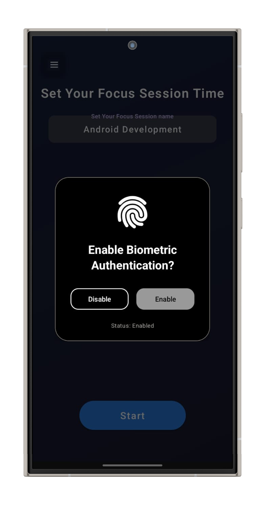
  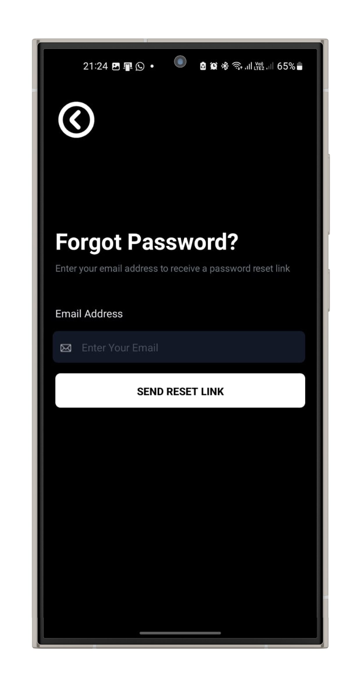
  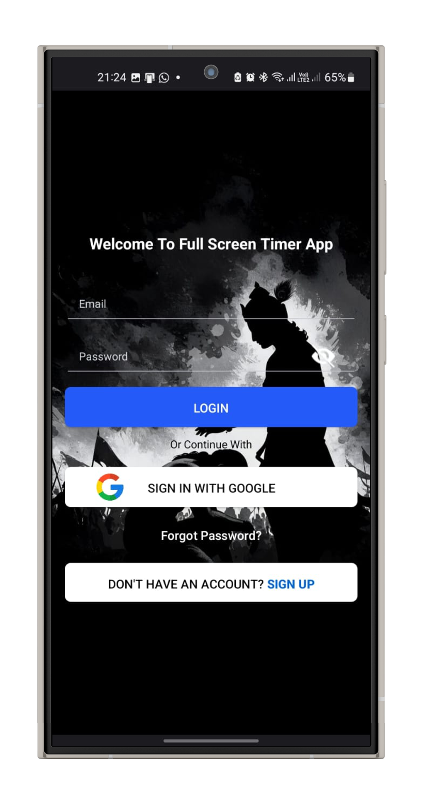
</p>

<!-- Row 2 (4 images) -->
<p align="center">
  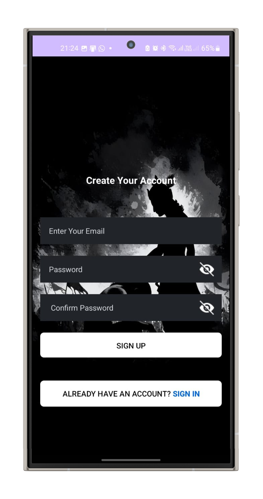
  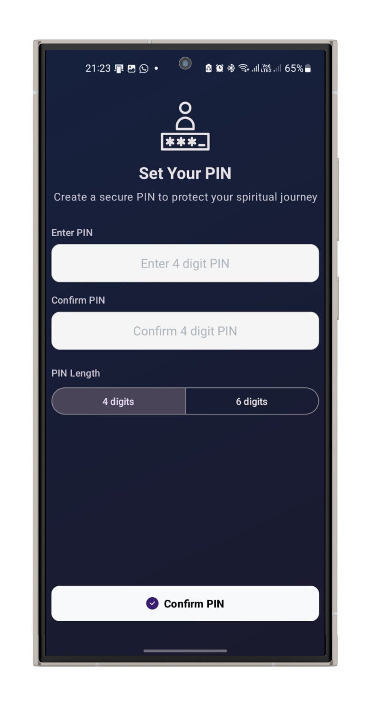
  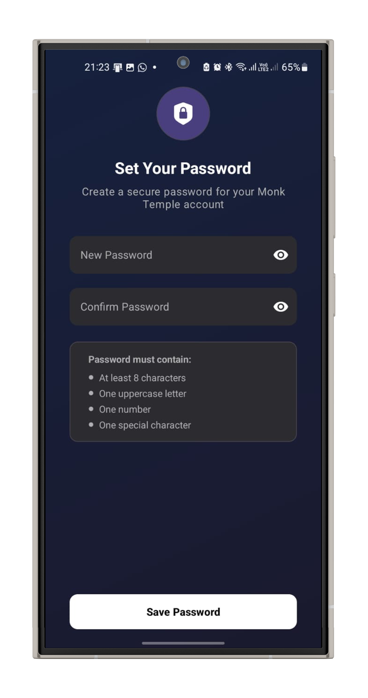
    
</p>

<!-- Row 3 (4 images) -->
<p align="center">
  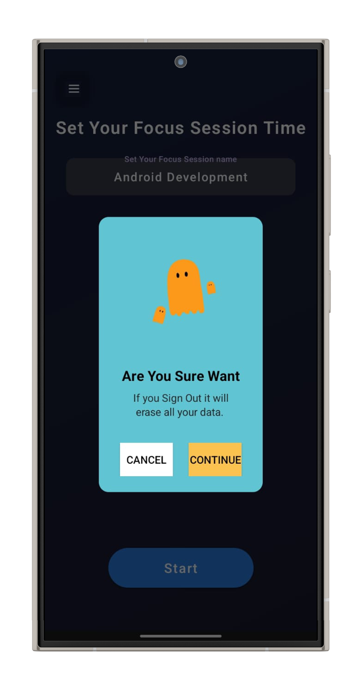
  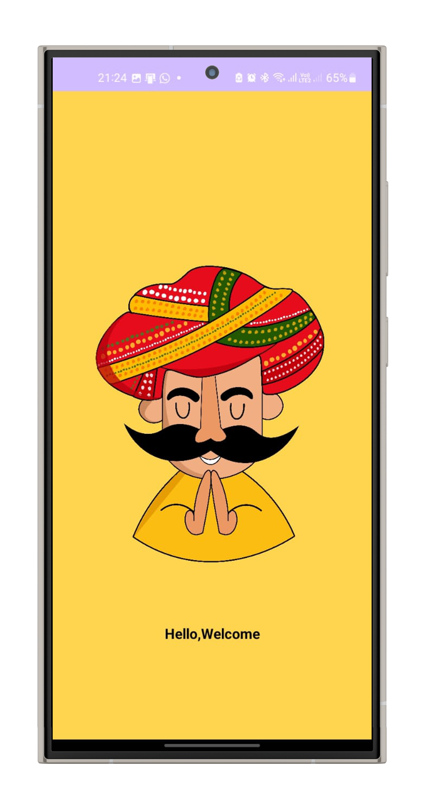
  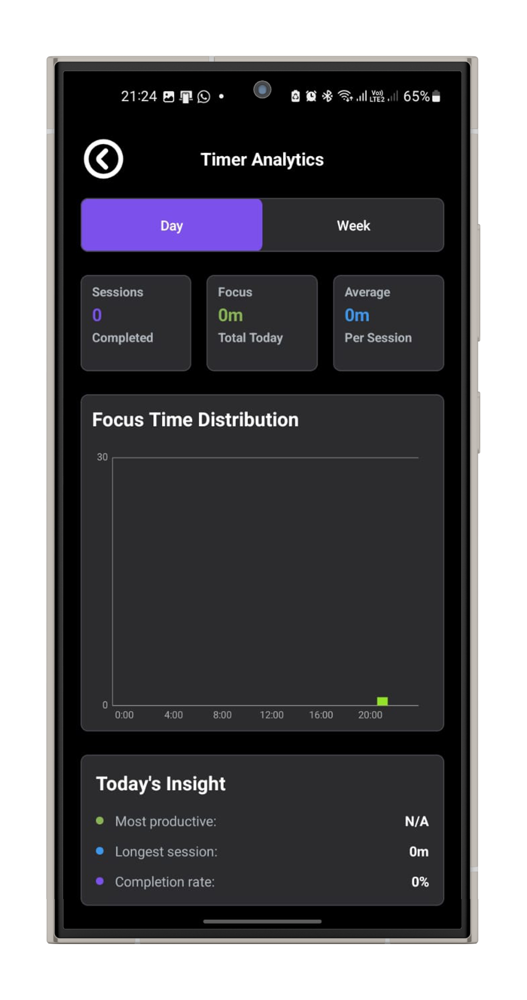
   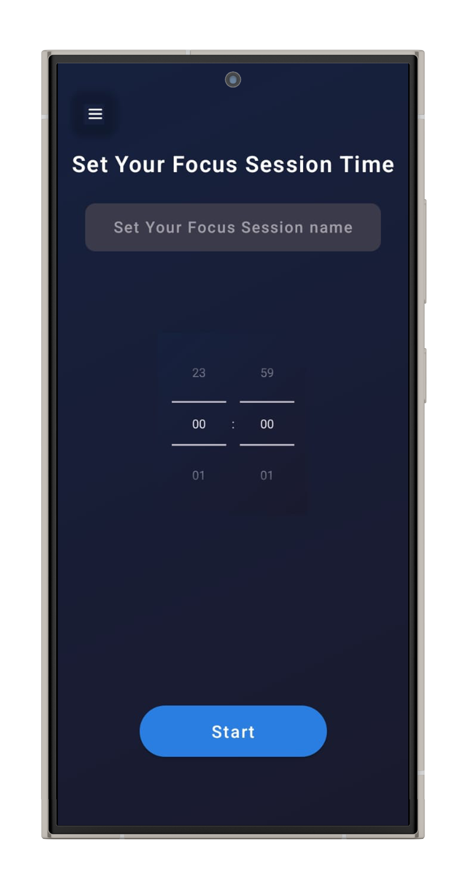
</p>

<!-- Row 4 (3 images) -->
<p align="center">
  
  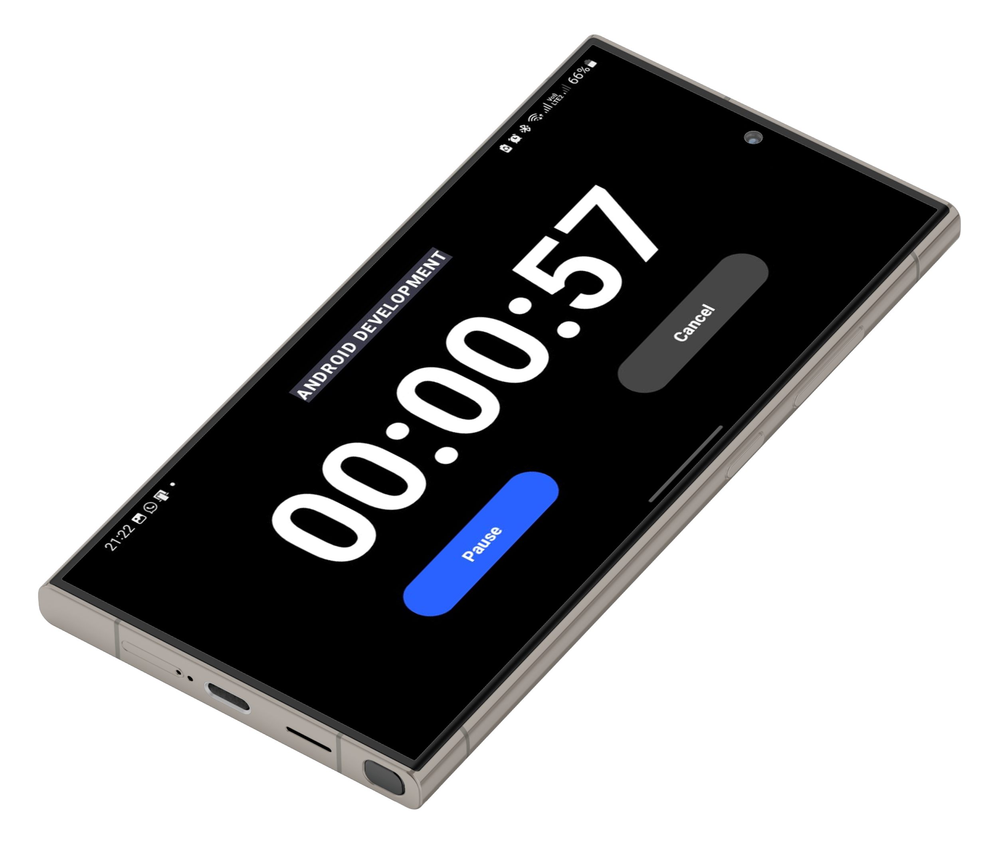
 
  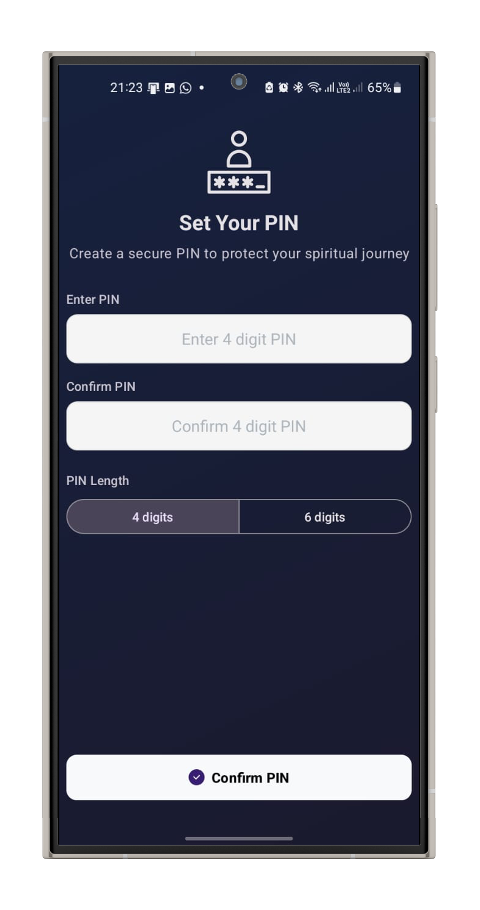
</p>


> 👉 Click the image above to view all app screenshots.

## 🚀 Getting Started  

Clone this repository and run it in **Android Studio**:  

```bash
git clone https://github.com/ShivamKumarPTU/Full_Screen_Timer.git
```
Download Apk (version :-v1.1)
```bash
https://github.com/ShivamKumarPTU/Full_Screen_Timer/releases/download/v1.1/app-release.apk
```
or 
[(https://github.com/ShivamKumarPTU/Full_Screen_Timer/releases/download/v1.1/app-release.apk)

1. Open the project in **Android Studio**.  
2. Build and run on your Android device or emulator.  
3. Start timing with style!  

---

## 📌 About  

⏱️ **Full Screen Timer** is designed for anyone who values **simplicity and focus**.  
Whether you’re studying, training, meditating, or just need a timer for daily tasks, this app provides a **minimalistic and visually pleasing experience**.  

---

## 🛠️ Tech Stack  
- **Language**: Kotlin  
- **IDE**: Android Studio  
- **Platform**: Android  

---

## ⭐ Contribute  

Want to improve this project? Fork the repo and submit a pull request!  
Feedback and contributions are always welcome.  

---

## 📄 License  
This project is licensed under the **MIT License** – feel free to use, modify, and distribute.  
